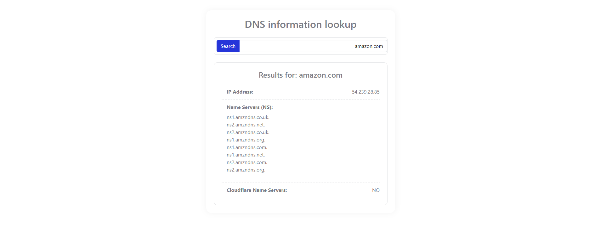

# DNS Lookup Tool 🌐

A Python-based tool to fetch DNS records (IP address, Name Servers) with a web interface and API endpoint.



## Features ✨
- Get IP address for any domain
- Retrieve all Name Servers (NS records)
- Check if domain uses Cloudflare name servers
- Simple REST API endpoint
- Clean web interface (supports both RTL/LTR)
- Lightweight and fast
- Docker container support

## Installation 🛠️

### Prerequisites
- Python 3.8+ **or** Docker
- pip package manager (if using Python directly)

### Option 1: Local Python Installation
```bash
git clone https://github.com/Erfanm83/DNS-Lookup-Tool.git
cd Dns-Lookup-Tool
pip install -r requirements.txt
```

### Option 2: Docker Installation
```bash
git clone https://github.com/yourusername/Dns-Lookup-Tool.git
cd Dns-Lookup-Tool
```

## Usage 🚀

### Running with Python
```bash
python dns_api.py
```
The API will be available at `http://localhost:5000`

### Running with Docker
1. Build the image:
   ```bash
   docker build -t dns-lookup-tool .
   ```

2. Run the container:
   ```bash
   docker run -d -p 5000:5000 --name dns-tool dns-lookup-tool
   ```

3. Access the API:
   ```bash
   curl "http://localhost:5000/dns-lookup?domain=example.com"
   ```

### API Endpoint
```http
GET /dns-lookup?domain=example.com
```

Example Response:
```json
{
  "domain": "example.com",
  "ipAddress": "93.184.216.34",
  "nameServers": ["a.iana-servers.net.", "b.iana-servers.net."],
  "cloudflareNameServers": false
}
```

### Using the Web Interface
1. Serve the `index.html` file (you can use Python's HTTP server):
   ```bash
   python -m http.server 8000
   ```
2. Open `http://localhost:8000` in your browser
3. Enter a domain name (e.g., `google.com`)
4. View the DNS records

## Deployment 🚢

### Production with Docker
```bash
docker run -d \
  -p 5000:5000 \
  --restart unless-stopped \
  --name dns-lookup \
  dns-lookup-tool
```

### Production with Docker Compose
Create `docker-compose.yml`:
```yaml
version: '3.8'
services:
  dns-lookup:
    build: .
    ports:
      - "5000:5000"
    restart: unless-stopped
```

Then run:
```bash
docker-compose up -d
```

## Project Structure 📂
```
Dns-Lookup-Tool/
├── dns_api.py          # Flask API server
├── index.html          # Web interface
├── Dockerfile          # Docker configuration
├── requirements.txt    # Python dependencies
├── README.md           # Documentation
└── screenshot.png      # Web interface preview
```

## Contributing 🤝
Pull requests are welcome! For major changes, please open an issue first.
